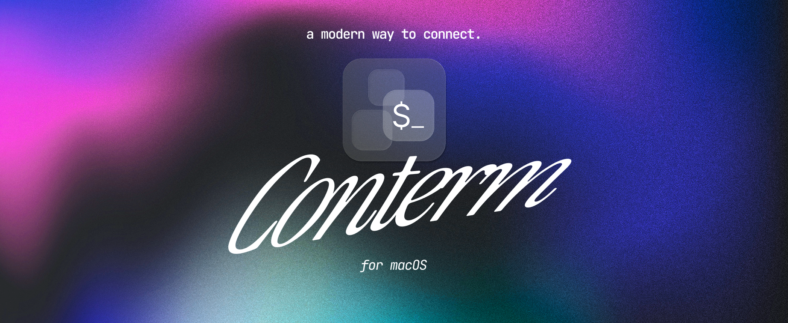

<p align="center">
  
</p>

<p align="center">
  <a href="https://github.com/mahdiarfrm/conterm/releases/latest"></a>
  <a href="https://github.com/mahdiarfrm/conterm/actions/workflows/ci.yml"></a>
  <a href="https://github.com/mahdiarfrm/conterm/blob/main/LICENSE"></a>
  <a href="https://github.com/mahdiarfrm/conterm/stargazers"></a>
  
</p>

<p align="center">
  <a href="https://github.com/mahdiarfrm/conterm/releases/latest"><b>Download</b></a> ·
  <a href="https://mahdiarfrm.github.io/conterm/">Website</a> ·
  <a href="https://github.com/mahdiarfrm/conterm/issues">Report a bug</a>
</p>

**Conterm** is a macOS terminal built on [Ghostty's](https://github.com/ghostty-org/ghostty)
engine, adding Liquid Glass chrome, splittable panes, a multi-source `⌘K`
command palette, and a command center for AI coding agents like Claude Code
and opencode.

> Conterm is an independent frontend built on **libghostty**. It is not
> affiliated with the Ghostty project. The terminal engine (rendering, parsing,
> fonts, themes, shell integration) is Ghostty's; Conterm adds the macOS app
> around it.

https://github.com/user-attachments/assets/afbe93e9-9741-46d3-9eef-1c7b0d62ab64

## Contents

- [Features](#features)
- [Install](#install)
- [Updating](#updating)
- [Keyboard shortcuts](#keyboard-shortcuts)
- [Configuration](#configuration)
- [Backup & restore](#backup--restore)
- [Building from source](#building-from-source)
- [How it fits together](#how-it-fits-together)
- [License](#license)

## Features

### Panes, tabs & sessions

- **Recursive split panes** — `⌘D` splits right, `⌘⇧D` splits down, to any
  depth. Drag the dividers to resize; focus any pane by number with `⌥1`–`⌥9`.
- **Tabs, top or sidebar** — move the tab bar to a left sidebar; it can
  auto-hide and slide back in when the cursor reaches the left edge.
- **Tab groups** — color-coded groups with inline rename, reordering, and a
  live list of every tab in each group; in the sidebar they fold into
  collapsible folders.
- **Session restore** — every window, tab, pane, split, and working directory
  comes back exactly where you left it on relaunch.
- **File drops** — drag a file or image onto a pane to insert its shell-quoted
  path at the cursor.

### Command palette (`⌘K`)

One search over everything:

- A single query reaches app commands, **shell history** (re-run any zsh/bash
  command), your `~/.ssh/config` hosts (with `Include` support), the active
  pane's **recently modified files**, built-in **notes**, and **every open
  pane across every window**.
- A **live calculator** in the search bar — arithmetic, `0x`/`0b`/`0o`
  literals, re-basing (`255 in hex`), and unit conversions across data sizes,
  time, length, mass, volume, and temperature.
- A **suggestion tray** under the search bar: five picks ranked by how often
  and how recently you use them.
- **Tab-group** management, quick **"open this directory in Finder /
  Cursor"**, and **reorder or hide** commands from *Settings → Palette*.

### Agent-aware

- **Status pills** — a per-pane pill shows when
  [Claude Code](https://www.anthropic.com/claude-code) or
  [opencode](https://opencode.ai) is *ready*, *thinking*, or *needs you*, with
  a notification center for what finished while you were away. Hooks are
  installed non-destructively.
- **Command center** (`⌘⇧A`) — a docked rail listing every running agent across
  all windows, *needs you* first. Each card shows its branch, the task it's
  working on, live cost / tokens / model, and how long since it last acted —
  with jump-to-pane and an inline reply / accept / interrupt. A toolbar pill
  appears with the running count.
- **Agents layout** — a third window layout whose sidebar *is* the live agent
  roster; an **Add agent** button opens Claude Code or opencode in a directory
  you pick, and a panes dropdown jumps to any open pane.
- **Command markers** *(shell integration)* — a ✓ / ✗ chip with the run time
  when a command fails or takes a while, a notification when a long command
  finishes while you've stepped away, and `⌘↑` / `⌘↓` to jump between prompts.

### Updates and backups

- **Automatic updates** — checked from GitHub on launch; a Liquid Glass pill
  appears in the toolbar when a new release is out, or run *Check for Updates*
  any time. No external service involved.
- **Backup & restore** — save your sessions, app settings, and Conterm +
  Ghostty config to a single file, and restore them on another machine
  (*Settings → Config*).

### Appearance

- **Liquid Glass chrome** *(macOS 26)* — refractive glass behind every surface
  with a Clear↔Frosted slider and light/dark tint, plus an opaque Solid mode
  when you want it. On macOS 14–15 the app runs fully with plain (non-glass)
  chrome.
- **Live system stats** — optional CPU / RAM / network sparklines in the tab
  bar, with a popover for detailed graphs.
- **Scrollback search** (`⌘F`), **SSH-host detection** in the pane chrome, and
  synthesized UI sound effects.

## Install

Download the latest `.dmg` from the
[Releases page](https://github.com/mahdiarfrm/conterm/releases/latest), open it,
and drag `Conterm.app` into `Applications`.

**First launch:** Conterm is ad-hoc codesigned (open-source, not notarized
through a paid Apple Developer account), so the first launch needs one step:
right-click `Conterm.app` → **Open** → **Open**. If macOS still refuses:

```bash
xattr -dr com.apple.quarantine /Applications/Conterm.app
```

### Requirements

- macOS **14 (Sonoma)** or later — tested through macOS 26 (Tahoe).
- **Apple Silicon** (M1 or later). Intel is untested.
- Liquid Glass / blur chrome requires **macOS 26**; on 14–15 the app is fully
  functional with plain chrome.

## Updating

Conterm checks GitHub for new releases on launch and shows an update pill in
the toolbar when one is available — click it to install and relaunch. You can
also trigger it from **Conterm → Check for Updates** or *Settings → Config*,
and turn the automatic check off there.

## Keyboard shortcuts

| Shortcut | Action |
|----------|--------|
| `⌘T` / `⌘N` | New tab / new window |
| `⌘W` | Close active pane (or tab) |
| `⌘D` / `⌘⇧D` | Split right / split down |
| `⌥1`–`⌥9` | Focus pane *N* in the current tab |
| `⌘1`–`⌘9` | Jump to tab *N* |
| `⌘↑` / `⌘↓` | Jump to previous / next prompt |
| `⌘K` | Command palette |
| `⌘⇧A` | Agent command center |
| `⌘F` | Search scrollback |
| `⌘,` | Settings |
| `Esc` | Dismiss palette / settings / search |

## Configuration

Conterm reads a single file: `~/.config/conterm/config`, in
[Ghostty's config syntax](https://ghostty.org/docs/config/reference).
*Settings → Config* shows the path and offers Open / Reload / Reset actions.

Already use Ghostty? Add a one-line include so both apps share settings:

```ini
config-file = ~/.config/ghostty/config
```

Edits in either file then apply to both on the next reload; anything written
*below* the include overrides Ghostty's value for Conterm only. **Safe mode**
(*Settings → Config*) boots on Ghostty's built-in defaults and ignores the
file — useful for recovering from a bad edit.

A few common options:

```ini
font-family = "JetBrains Mono"
font-size = 14

cursor-style = bar             # bar | block | underline
cursor-style-blink = true

background-opacity = 0.9
background-blur = 20

# command = "/opt/homebrew/bin/fish"   # default is $SHELL
```

## Backup & restore

From *Settings → Config*, **Back Up** writes a single `.contermbackup` file
containing your app settings, sessions, notes, tab groups, and both the Conterm
and Ghostty config files. **Restore** reads it back and relaunches — handy when
moving to a new machine.

## Building from source

Requires the Swift toolchain (Command Line Tools is enough — no full Xcode):

```bash
xcode-select --install

git clone https://github.com/mahdiarfrm/conterm.git
cd conterm

bash scripts/setup.sh    # fetch GhosttyKit.xcframework
bash scripts/build.sh    # build + assemble Conterm.app
open ./Conterm.app
```

`scripts/build.sh` produces a release, arm64, ad-hoc-codesigned `Conterm.app`
with the bundled config, terminfo, and icon.

## How it fits together

Conterm is a SwiftUI + AppKit app that drives libghostty through
`GhosttyKit.xcframework`. Each pane owns a `ghostty_surface_t` and the `NSView`
it renders into; the SwiftUI layer handles tabs, splits, the palette, and the
glass chrome. The terminal core — GPU rendering, parsing, fonts and ligatures,
themes, and shell integration — is entirely Ghostty's.

```
Sources/Conterm/
  Main.swift        @main + AppDelegate, window management
  State/            tabs, pane tree, preferences, stores
  Ghostty/          libghostty Swift bridge (surfaces, input)
  UI/               SwiftUI shell: palette, tabs, chrome, effects
```

Contributions and issue reports are welcome on the
[issue tracker](https://github.com/mahdiarfrm/conterm/issues).

## License

MIT — see [LICENSE](LICENSE). Built on
[libghostty](https://github.com/ghostty-org/ghostty); not affiliated with the
Ghostty project.
