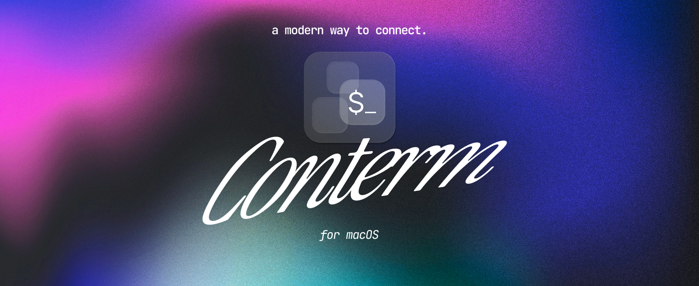

<p align="center">
  
</p>

<p align="center">
  <a href="https://github.com/mahdiarfrm/conterm/releases/latest"></a>
  <a href="https://github.com/mahdiarfrm/conterm/actions/workflows/ci.yml"></a>
  <a href="https://github.com/mahdiarfrm/conterm/blob/main/LICENSE"></a>
  <a href="https://github.com/mahdiarfrm/conterm/stargazers"></a>
  
</p>

<p align="center">
  <a href="https://github.com/mahdiarfrm/conterm/releases/latest"><b>Download</b></a> ·
  <a href="https://mahdiarfrm.github.io/conterm/">Website</a> ·
  <a href="https://github.com/mahdiarfrm/conterm/issues">Report a bug</a>
</p>

**Conterm** is a native macOS terminal built on
[Ghostty's](https://github.com/ghostty-org/ghostty) engine. It adds a `⌘K`
command palette, vertical tabs and tab groups, widgets, notifications, a
command center for AI coding agents like Claude Code, Codex and opencode,
and live overviews of your SSH hosts, Kubernetes clusters, and containers.

> Conterm is an independent frontend built on **libghostty**. It is not
> affiliated with, endorsed by, or sponsored by the Ghostty project. The
> terminal engine (rendering, parsing, fonts, themes, shell integration) is
> Ghostty's, MIT-licensed; Conterm adds the macOS app around it. Full
> third-party notices are in [NOTICE.md](NOTICE.md).

https://github.com/user-attachments/assets/afbe93e9-9741-46d3-9eef-1c7b0d62ab64

## Contents

- [Features](#features)
- [Install](#install)
- [Updating](#updating)
- [Keyboard shortcuts](#keyboard-shortcuts)
- [Configuration](#configuration)
- [Backup & restore](#backup--restore)
- [Building from source](#building-from-source)
- [How it fits together](#how-it-fits-together)
- [License](#license)

## Features

### Panes, tabs & sessions

- **Recursive split panes** — `⌘D` splits right, `⌘⇧D` splits down, to any
  depth. Drag the dividers to resize; focus any pane by number with `⌥1`–`⌥9`.
- **Tabs, top or sidebar** — move the tab bar to a left sidebar; it can
  auto-hide and slide back in when the cursor reaches the left edge.
- **Tab groups** — color-coded groups with inline rename, reordering, and a
  live list of every tab in each group; in the sidebar they fold into
  collapsible folders.
- **Session restore** — every window, tab, pane, split, and working directory
  comes back exactly where you left it on relaunch.
- **File drops & image paste** — drag a file or image onto a pane to insert
  its shell-quoted path at the cursor; `⌘V` with an image on the clipboard
  (browser "Copy Image", screenshot tools) pastes the same way, so agents
  like Claude Code can read it. Drop or paste on an SSH pane and it's
  uploaded instead — `scp` to the remote working directory, a badge on the
  pane while it transfers, and the remote path typed at the prompt.
- **Find in scrollback** (`⌘F`) — the terminal's own search engine highlights
  every match and centers the one you step to (`⌘G` / `⌘⇧G`; `⌘E` searches the
  selection). Panes running Claude Code add a *Conversation* scope over the
  session transcript — the only way to search a fullscreen session, whose
  conversation never touches scrollback — and can hand the query to Claude
  Code's own transcript search.

### Command palette (`⌘K`)

One search over everything:

- A single query reaches app commands, **shell history** (re-run any zsh/bash
  command), **clipboard history** (recent copies from panes — session-only,
  never written to disk), your `~/.ssh/config` hosts (with `Include` support),
  the active pane's **recently modified files**, built-in **notes**, and
  **every open pane across every window**.
- A **live calculator** in the search bar — arithmetic, `0x`/`0b`/`0o`
  literals, re-basing (`255 in hex`), and unit conversions across data sizes,
  time, length, mass, volume, and temperature.
- A **suggestion tray** under the search bar: five picks ranked by how often
  and how recently you use them.
- **Tab-group** management, quick **"open this directory in Finder /
  Cursor"**, and **reorder or hide** commands from *Settings → Palette*.

### Agent-aware

- **Status pills** — a per-pane pill shows when
  [Claude Code](https://www.anthropic.com/claude-code),
  [Codex](https://github.com/openai/codex) or
  [opencode](https://opencode.ai) is *ready*, *thinking*, or *needs you*, with
  a notification center for what finished while you were away. Hooks are
  installed non-destructively (Claude's in `~/.claude/settings.json`,
  Codex's in `~/.codex/hooks.json`; both run one script).
- **Activity bubbles** — whatever Claude or Codex is doing pops up beside the pill
  as a monochrome bubble, one per kind in flight, its ring sweeping in that
  kind's colour: terraform, ansible, kubectl, helm, docker, ssh, git, gh,
  plain shell, reading and editing files, searching code, web search and
  fetch, sub-agents, task lists, skills, MCP tools. The cluster stays
  centred as bubbles come and go; finished calls fold into a glass
  *History* capsule at the pane's top-left. Click either for each call's
  command, duration, verdict and output; an *Agent Tools* palette command
  opens the same record for the focused pane.
- **Command center** (`⌘⇧A`) — a docked rail listing every running agent across
  all windows, *needs you* first. Each card shows its branch, the task it's
  working on, live cost / burn rate / tokens / model, and how long since it
  last acted — with jump-to-pane, search-in-conversation, and an inline
  reply / accept / interrupt. `claude --bg` background sessions join the
  roster with one-click resume, and a *Next Blocked Agent* palette command
  cycles through the agents waiting on you. A toolbar pill appears with the
  running count.
- **Agents layout** — a third window layout whose sidebar *is* the live agent
  roster; an **Add agent** button opens Claude Code, Codex or opencode in a
  directory you pick — or one you have worked in before, listed for you —
  and a panes dropdown jumps to any open pane. A session started somewhere
  Claude has never run says it is waiting on the trust prompt rather than
  reading as idle.
- **Command markers** *(shell integration)* — a ✓ / ✗ chip with the run time
  when a command fails or takes a while, a notification when a long command
  finishes while you've stepped away, and `⌘↑` / `⌘↓` to jump between prompts.
- **Tool bubbles** — a bubble per kind of tool call in flight beside the
  agent pill, so a glance says what the agent has its hands in — terraform,
  kubernetes, the shell, the web, a sub-agent. Finished calls fold into a
  History capsule that opens the record: every call with what it was about,
  how long it took, how it ended, and its output.
- **Working-tree review** — the pill says the agent is thinking; this says
  what it changed. Each agent card carries a live count of the files it has
  touched since it started, with the insertions and deletions; click through
  for the full picture — the commits it made, every file still uncommitted,
  and the diff of whichever one you pick. *Reviewed* re-baselines, so the
  next look starts from what you just read. Also on `⌘K` → *Review Changes*.
- **While you were away** — come back after a real absence and one card sums
  up what happened: agents that finished or got blocked, playbooks and
  rollouts, cluster alerts, failed commands, and any changes left unreviewed.
  The threshold for "away" is yours to set; `⌘K` opens it on demand.

### Hosts & clusters

- **Host Overview** — right-click an SSH pane (or click the ⓘ beside its
  title pill) for a glass briefing on the machine: load, memory, disks,
  network, containers, VMs, Kubernetes, crons and timers, failed units,
  recent journal and kernel errors, logins, and pending updates — gathered
  in one key-authenticated SSH round trip. A status gem sums the host:
  green up, amber wants attention, red in trouble.
- **Fleet run** — pick hosts in the palette, type one command, and get a
  tab with a pane per host running it over SSH — or leave the command empty
  to just connect everywhere.
- **Kubernetes context** — a tab-bar pill shows where kubectl points;
  production contexts turn it red and put a red glow on the focused
  pane's border. Click to switch context: by default a switch applies to
  the focused pane only (exported silently into that shell), so new panes
  start on your default — or flip one toggle to make switches global.
  Rollouts (`rollout restart`, `set image`, `scale`, `apply`) trace a
  progress rim around the pill as replicas come ready — green on
  completion, red on a stall, with notifications for both.
- **Cluster Overview** — every context row in the Kubernetes popover opens
  a briefing card on that cluster: nodes with pressure bars, workloads with
  per-pod health dots and ready bars, services, Helm releases, and recent
  warning events, across every namespace — a header chip narrows to one.
  An optional watcher polls pod health in the background, sums it in a
  status gem on the pill, and notifies when a pod starts crash-looping.
- **Containers** — running containers across Docker, Podman, containerd,
  and Apple's `container` in one pill, grouped by runtime in its popover;
  hover a row to shell in, tail its logs, or restart it.
- **Ansible cockpit** — running `ansible-playbook` in a pane mirrors the
  run (console untouched) into a live hosts × tasks matrix: per-cell
  results, task durations with a slowest callout, the changed footprint,
  and a failure feed with messages. A widget tracks runs across all
  windows and keeps the machine's most recent report across relaunches.
- **Terraform cockpit** — `terraform plan` (or `tofu plan`) comes back as a
  card instead of a wall of `~` and `->`: what it destroys and replaces
  first, then what it creates and updates, with the attributes each update
  actually touches. The saved plan is read back with `terraform show -json`
  and deleted immediately — a plan file carries state values, secrets
  included. Off in *Settings → Integrations* if you'd rather terraform not
  save a plan at all.

### Orbit — the fleet as a map *(beta)*

Orbit is new and still settling — the shape is there, the edges are not.
Treat it as beta.

- **A layout mode, not a panel** (`⌘⇧M`) — entering Orbit collapses the tab
  bar and gives the window to a live graph of what you are working on:
  your agent sessions, the hosts they talk to, the clusters and containers
  under them, and the plan's own running work. A session is the subject and
  a host is where it runs, so sessions ride the ring closest to your Mac.
- **Everything happens here** — Connect docks a real terminal at the foot of
  the canvas (`⇧⌘F` gives it the whole thing), overviews and logs open as
  panels over the map, and a run's output comes back to it. Nothing sends
  you out to a tab.
- **Find anything** (`⌘K`) — hosts, sessions, clusters, containers, pods and
  routines by name, including hosts you have never connected to and ones
  from `~/.ssh/config`. Return brings the match to the middle and aims the
  action bar at it.
- **Drive it from the keyboard** — holding `⌥` lights a letter on every card;
  press it to aim there, and the arrows walk the graph from there. Every verb
  on the action bar has a key, and `?` lists them.
- **Since you looked away** — leaving writes a snapshot, entering reports the
  difference: a session that started waiting on you, one that finished while
  you were gone, a scheduled run that failed, a host that came or went.
- **Routines** — named, parameterised, repeatable work: add a key to twelve
  servers, deploy, go to maintenance mode. Write the steps once, fill in the
  details at launch, and run them now, at a time, or after something else
  finishes. The engine runs app-wide, so they fire whether or not the map is
  on screen, and failures notify.
- **What each host said** — a run's history records every target separately,
  so a step across twelve machines reports *11/12 ok*, names the one that
  didn't, and opens what any of them actually said.
- **Guard rails on production** — anything named like production (the same
  pattern list the Kubernetes pill uses, applied to hosts too) puts a
  confirmation in front of scaling, rolling, cordoning, a real Ansible run
  or a routine — naming what is about to happen and where.
- **Drill in** — a host blooms open into its containers, VMs and kubelet; a
  cluster into nodes, pods and containers, each with its own verbs. An
  overview map keeps the whole graph in one corner when you have zoomed in.

### Conterm for iOS

- **Your sessions on your phone** — every window, tab and pane, which agent
  is waiting on you, and a reply back to it. Conterm publishes what it's
  doing to a file the phone reads over the SSH connection you already have:
  no listening port, no account, no relay, and nothing to authenticate that
  your own key doesn't already cover. It works from anywhere you can reach
  the machine, jump hosts included.
- **Nearby** — the Mac advertises itself on the local network, so the phone
  lists it instead of asking you to type a hostname. The advertisement
  carries the username to prefill and whether Remote Login is actually
  accepting connections, so a host that would refuse never gets offered.
- Off until you ask for it, in *Settings → Integrations*. Nothing is
  published while it's off.

### Updates and backups

- **Automatic updates** — checked from GitHub at launch and once a day while
  running; a Liquid Glass pill appears in the toolbar when a new release is
  out, or run *Check for Updates* any time. No external service involved.
- **Backup & restore** — save your sessions, app settings, and Conterm +
  Ghostty config to a single file, and restore them on another machine
  (*Settings → Config*).

### Appearance

- **Liquid Glass chrome** *(macOS 26)* — refractive glass behind every surface
  with a Clear↔Frosted slider and light/dark tint, plus an opaque Solid mode
  when you want it. On macOS 14–15 the app runs fully with plain (non-glass)
  chrome.
- **Widgets** — glanceable pills in the tab bar or sidebar: system stats,
  clock, battery, git status, GitHub PR checks, ping, public IP (VPN-aware),
  notes, session streaks, Ansible runs, the kubectl context (with a
  click-to-switch popover), containers across runtimes (Docker, Podman,
  containerd, Apple's container), and a pixel cat. Enable and reorder them
  in *Settings → Widgets*.
- **Interface size** — one slider scales the chrome around the terminal — tab
  bar, sidebar, toolbar, agent rail — without touching the terminal's own
  font size (*Settings → Interface size*). Pane corners are tunable on their
  own axis.
- **A pane that needs you says so** — its border pulses amber while its agent
  waits on input, and so does its tab's dot, so a background tab that has
  stopped is visible from whichever one you are in.
- **SSH-host detection** in the pane chrome, and synthesized UI sound effects.

## Install

Download the latest `.dmg` from the
[Releases page](https://github.com/mahdiarfrm/conterm/releases/latest), open it,
and drag `Conterm.app` into `Applications`.

**First launch:** Conterm is self-signed (open-source, not notarized
through a paid Apple Developer account), so the first launch needs one step:
right-click `Conterm.app` → **Open** → **Open**. If macOS still refuses:

```bash
xattr -dr com.apple.quarantine /Applications/Conterm.app
```

macOS may then ask for access to folders like Documents or Downloads —
that's your shell and its tools (git, kubectl, claude) reading files
there, which is what a terminal does. Approve once; the grant survives
updates.

### Requirements

- macOS **14 (Sonoma)** or later — tested through macOS 26 (Tahoe).
- **Apple Silicon** (M1 or later). Intel is untested.
- Liquid Glass / blur chrome requires **macOS 26**; on 14–15 the app is fully
  functional with plain chrome.

## Updating

Conterm checks GitHub for new releases at launch and once a day while running,
and shows an update pill in the toolbar when one is available — click it to
install and relaunch. You can also trigger it from **Conterm → Check for
Updates** or *Settings → Config*, and turn the automatic check off there.

## Keyboard shortcuts

| Shortcut | Action |
|----------|--------|
| `⌘T` / `⌘N` | New tab / new window |
| `⌘W` | Close active pane (or tab) |
| `⌘D` / `⌘⇧D` | Split right / split down |
| `⌥1`–`⌥9` | Focus pane *N* in the current tab |
| `⌘1`–`⌘9` | Jump to tab *N* |
| `⌘↑` / `⌘↓` | Jump to previous / next prompt |
| `⌘K` | Command palette |
| `⌘⇧A` | Agent command center |
| `⌘⇧M` | Orbit — the fleet map |
| `⌘F` | Find in scrollback / Claude conversation |
| `⌘G` / `⌘⇧G` | Next / previous match |
| `⌘E` | Use selection for find |
| `⌘,` | Settings |
| `Esc` | Dismiss palette / settings / search |

## Configuration

Conterm reads a single file: `~/.config/conterm/config`, in
[Ghostty's config syntax](https://ghostty.org/docs/config/reference).
*Settings → Config* shows the path and offers Open / Reload / Reset actions.

Already use Ghostty? Add a one-line include so both apps share settings:

```ini
config-file = ~/.config/ghostty/config
```

Edits in either file then apply to both on the next reload; anything written
*below* the include overrides Ghostty's value for Conterm only. **Safe mode**
(*Settings → Config*) boots on Ghostty's built-in defaults and ignores the
file — useful for recovering from a bad edit.

A few common options:

```ini
font-family = "JetBrains Mono"
font-size = 14

cursor-style = bar             # bar | block | underline
cursor-style-blink = true

background-opacity = 0.9
background-blur = 20

# command = "/opt/homebrew/bin/fish"   # default is $SHELL
```

## Backup & restore

From *Settings → Config*, **Back Up** writes a single `.contermbackup` file
containing your app settings, sessions, notes, tab groups, and both the Conterm
and Ghostty config files. **Restore** reads it back and relaunches — handy when
moving to a new machine.

## Building from source

Requires the Swift toolchain (Command Line Tools is enough — no full Xcode):

```bash
xcode-select --install

git clone https://github.com/mahdiarfrm/conterm.git
cd conterm

bash scripts/setup.sh    # fetch GhosttyKit.xcframework
bash scripts/build.sh    # build + assemble Conterm.app
open ./Conterm.app
```

`scripts/build.sh` produces a release, arm64, ad-hoc-codesigned `Conterm.app`
with the bundled config, terminfo, and icon.

`setup.sh` fetches the prebuilt GhosttyKit at the pinned commit. Official
releases instead ship a GhosttyKit built from source with the local patches
in `patches/ghostty/` (currently a renderer-teardown fix,
[reported upstream](https://github.com/ghostty-org/ghostty/discussions/13242)).
To build that kit yourself:

```bash
bash scripts/build-ghostty.sh install   # clone pin, apply patches, zig build, install
```

The script fetches the pinned zig toolchain on its own if needed; the pin
constants live in `scripts/ghostty-pin.sh`.

## How it fits together

Conterm is a SwiftUI + AppKit app that drives libghostty through
`GhosttyKit.xcframework`. Each pane owns a `ghostty_surface_t` and the `NSView`
it renders into; the SwiftUI layer handles tabs, splits, the palette, and the
glass chrome. The terminal core — GPU rendering, parsing, fonts and ligatures,
themes, and shell integration — is entirely Ghostty's.

```
Sources/Conterm/
  Main.swift        @main + AppDelegate, window management
  State/            tabs, pane tree, preferences, stores
  Ghostty/          libghostty Swift bridge (surfaces, input)
  UI/               SwiftUI shell: palette, tabs, chrome, effects
```

Contributions and issue reports are welcome on the
[issue tracker](https://github.com/mahdiarfrm/conterm/issues).

## License

MIT — see [LICENSE](LICENSE). Built on
[libghostty](https://github.com/ghostty-org/ghostty); not affiliated with the
Ghostty project.
